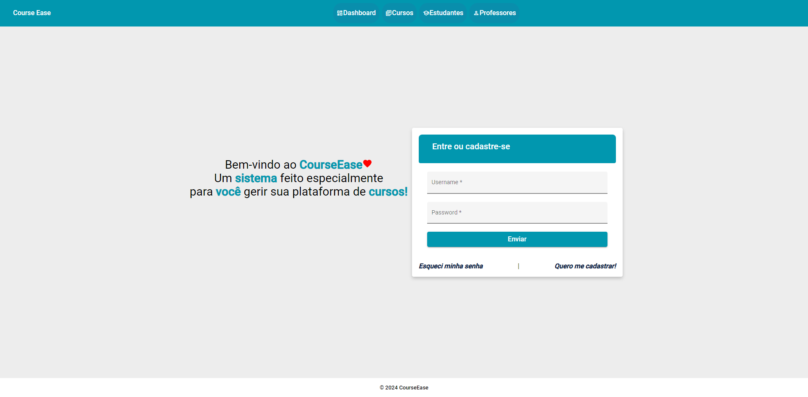
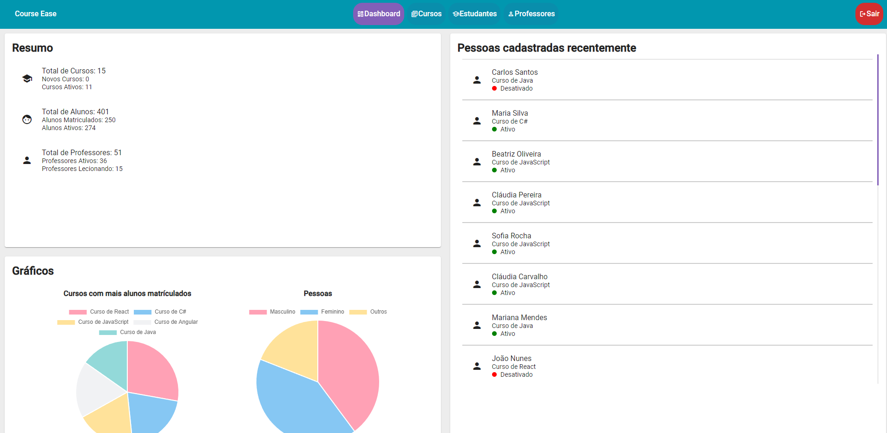
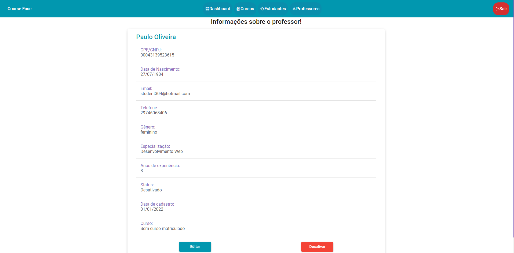
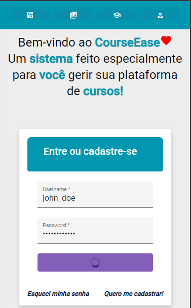
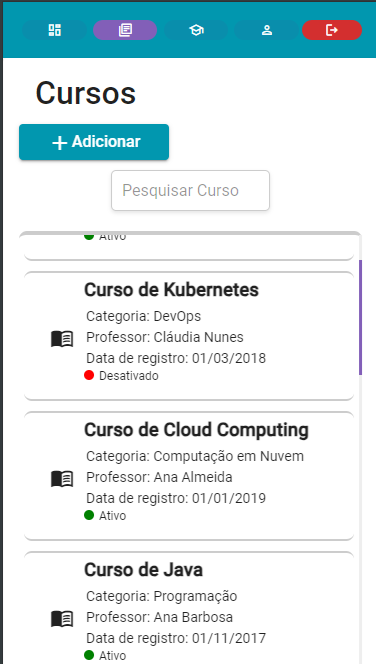
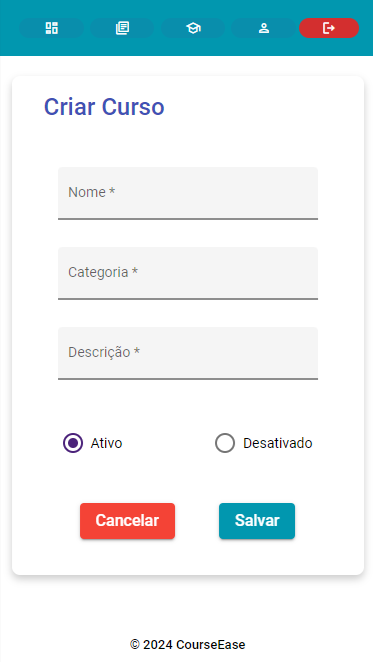

# Course Ease App

## :world_map: Índice

- [Sobre o Projeto](#information_source-sobre-o-projeto)
- [Funcionalidades](#hammer-funcionalidades)
- [Instalação](#hammer_and_wrench-instalação)
- [Sprints](#bulb-sprints)
- [Tecnologias e Recursos](#open_book-tecnologias-e-recursos-utilizados)

## :information_source: Sobre o projeto

<br>
A app faz parte do sistema Course Easse para gestão de cursos. <br>
App em produção: [CourseEaseAPP](https://courseease.vercel.app/)
Link API: [CourseEaseAPI](https://github.com/getwlad/course-ease-back) 

## :hammer: Funcionalidades

### Criar, obter, listar, atualizar ou desativar:

- Cursos
- Estudantes
- Professores
- Usuários

### Gerar

- Relatório de determinadas informações

### Imagens layout: <br>

<details>
  <summary>Layout Desktop</summary>



</p>
</details>
<details>
  <summary>Layout Mobile</summary>



</details>

## :hammer_and_wrench: Instalação

Você pode obter uma cópia do projeto caso tenha o git instalado, através do comando:

```bash
git clone https://github.com/getwlad/vs13-formacao-complementar-node-angular-front.git
```

Utilize uma IDE compatível com Node js para executar a aplicação e execute os comandos:

```bash
npm install -g @angular/cli
npm i
ng serve
```

No arquivo `.src/app/services/api.service.ts` é necessário definir o url da api.<br>

## :bulb: Sprints

| Sprint     | Descrição                         |
| :--------- | :-------------------------------- |
| `Sprint 1` | Desenvolvimento e lançamento MVP |

## :open_book: Tecnologias e Recursos Utilizados


[](https://trello.com/)
[](https://git-scm.com/doc)
[](https://github.com/)

